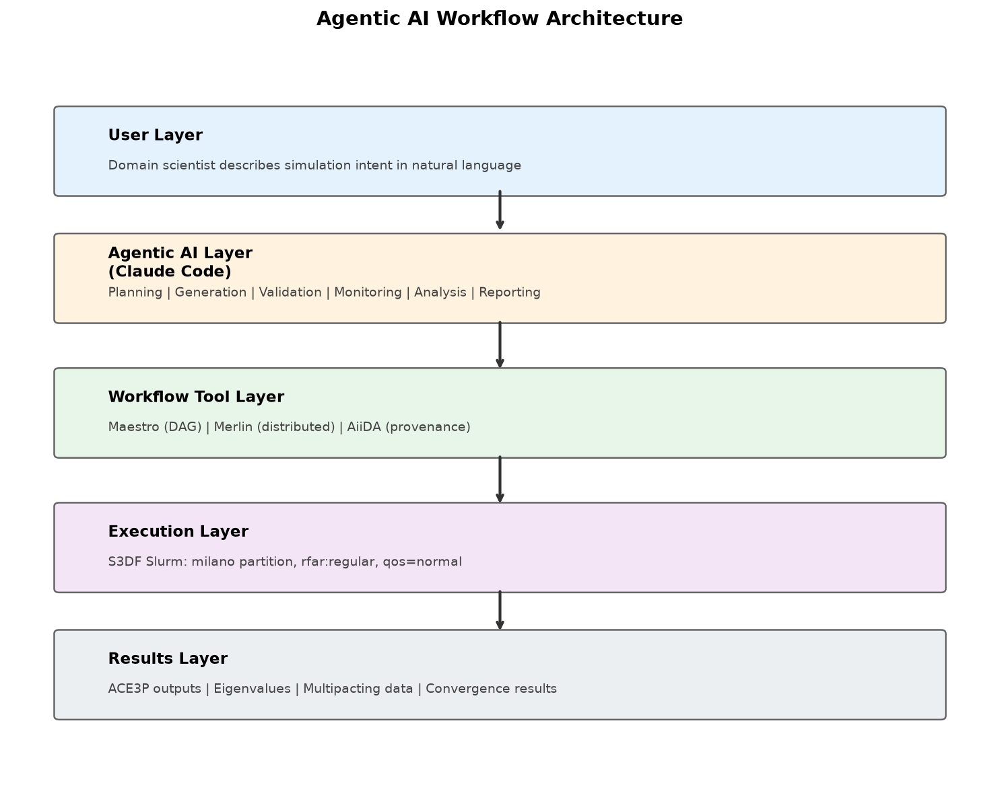
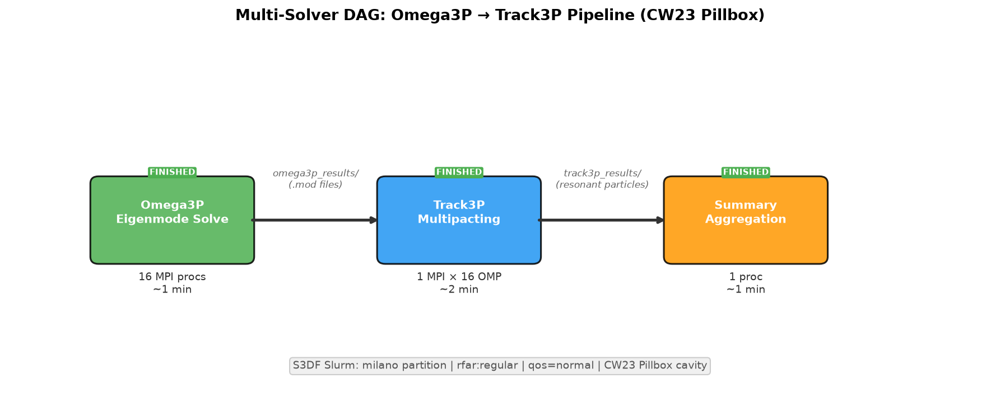
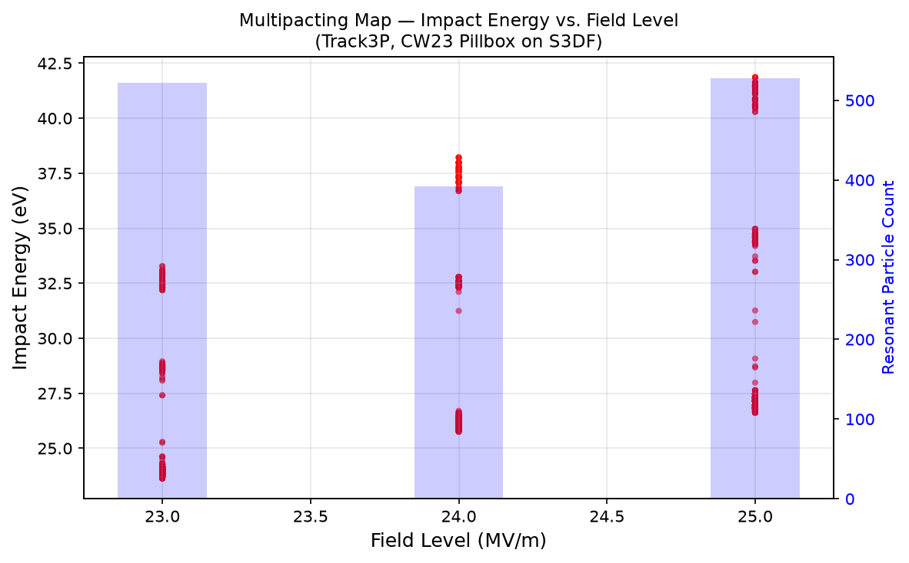
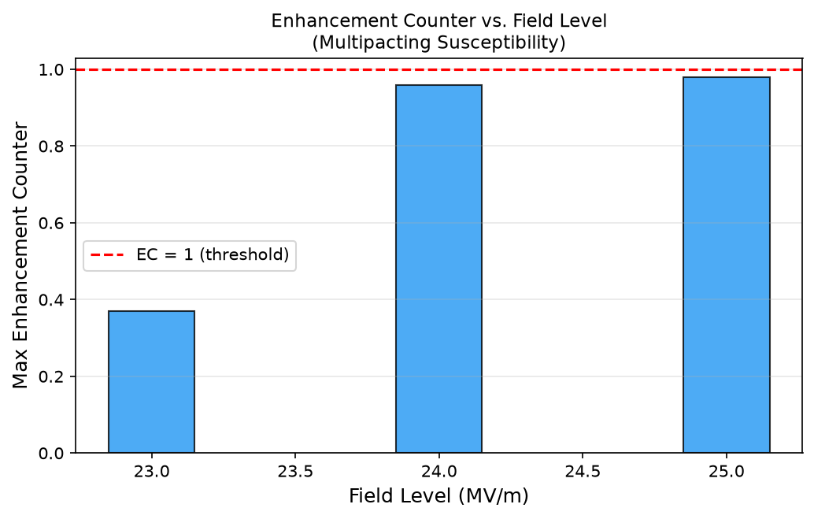

<!-- Use with reveal.js, Marp, or any markdown slide renderer -->
<!-- Slide separator: --- -->

# AI Agentic Workflow Automation for S3DF

**Integrating Maestro, Claude Code, and ACE3P Simulation Pipelines**

Lixin Ge | SLAC National Accelerator Laboratory

July 2026

---

# The Problem: Manual HPC Workflow Management

Researchers manage multi-step simulations with ad-hoc scripts

**Pain points on S3DF:**

- Manually writing Slurm batch scripts for each solver
- Hand-maintaining directory structures for parameter sweeps
- No automatic dependency tracking between solver steps
- Failures require manual identification and resubmission
- New users face steep learning curve for HPC workflows

> **Question:** Can AI help go from scientific intent to running workflow?

---

# Solution: Agentic AI + Workflow Automation

**Natural language → Validated workflow → Autonomous execution → Results + Plots**

| Component | Role |
|-----------|------|
| Claude Code | AI agent for reasoning and generation |
| Maestro | DAG-based workflow orchestration (LLNL) |
| S3DF Slurm | HPC execution (milano, rfar:regular) |
| ACE3P | Production EM simulation (demo app) |
| Post-processing | Matplotlib plots for immediate feedback |

**Key insight:** AI coordinates existing tools, doesn't replace them

---

# System Architecture



User → AI Agent → Workflow Engine → Slurm → Results

---

# What Makes This "Agentic"?

| Property | How We Demonstrate It |
|----------|----------------------|
| Natural language interface | User describes intent, not implementation |
| Domain reasoning | AI knows ACE3P solvers, S3DF config, Slurm |
| Autonomous execution plan | Generates full DAG with dependencies |
| Actionable output | YAML runs directly with `maestro run` |
| Multi-step orchestration | Chains solvers, manages data flow |
| Fault tolerance | Merlin: retry logic + distributed execution |

---

# AI Workflow Generator — One Command

**Input (natural language):**

```bash
python generator.py "Sweep gradient from 10 to 50 MV/m
  in Track3P to find multipacting onset"
```

**Output (executable Maestro YAML):**

- 5-step pipeline: mesh → omega3p → rfpost → track3p → analyze
- Correct S3DF Slurm config (partition, account, walltime)
- 9 parameterized gradient levels (10–50 MV/m)
- Fan-in aggregation with multipacting onset detection
- Passes YAML validation automatically

**→ Live demo at end of presentation**

---

# What Have I Built?

I've developed a prototype that demonstrates the concept end-to-end:

1. A user describes their workflow in plain English
2. The AI generates a complete, validated workflow specification
3. The workflow submits to S3DF Slurm and runs autonomously
4. Results and plots are generated automatically

I've validated this with real ACE3P simulations.

---

# Case Study: Multi-Solver DAG (Omega3P → Track3P)



CW23 Pillbox: Omega3P (16 MPI) → Track3P (1 MPI × 16 OMP). Full pipeline ~5 min.

---

# Multipacting Results — Auto-Generated



Impact energy vs. field level. Resonant particles at 23, 24, 25 MV/m.

---

# Enhancement Counter — Multipacting Susceptibility



EC approaches 1.0 at 24–25 MV/m — onset of sustained multipacting.

---

# Web Visualization (Available on S3DF)

**ParaView 5.11.1 Web Visualizer:**
- Full 3D visualization in browser — no client install
- `/sdf/group/rfar/software/ParaView-5.11.1-.../`

**Cubit 16.12 (Mesh Generation):**
- `/sdf/group/rfar/software/Cubit-16.12/`
- GUI via NoMachine or batch mode

**ACE3P Dashboard (Next.js):**
- `/workflow/status` — real-time Slurm monitoring
- `/workflow/generate` — AI generator web UI
- `/workflow/results` — auto-generated plots

---

# Results Summary

| Test | Result | Time |
|------|--------|------|
| Omega3P single solve | Matches reference (8 digits) | ~1 min |
| FE convergence (orders 1,2,3) | 0.08% → <0.001% error | 3 parallel, ~2 min each |
| Multi-solver DAG | Multipacting at 23–25 MV/m | ~5 min total |
| AI → Maestro YAML | Valid 4-step workflow | ~5 sec |
| AI → Merlin YAML | 4 worker pools + retry | ~10 sec |
| AI → Track3P sweep | 5-step + onset detection | ~8 sec |

---

# Broader Impact — Beyond ACE3P

**Framework is application-agnostic:**

- Any multi-step simulation (LCLS, cryo-EM, materials science)
- AI/ML training workflows (hyperparameter sweeps)
- Data analysis pipelines (reduction, calibration, visualization)
- Performance benchmarking (scaling studies)

**Benefits for S3DF community:**

- Lower barrier to HPC workflow adoption
- Reduced errors from manual scripting
- Workflow YAML = executable documentation (reproducibility)
- AI assists with monitoring, troubleshooting, documentation

---

# Next Steps

**Near-term (August 2026):**
- WORKS26 paper submission (deadline: Aug 7)
- Deploy dashboard with live monitoring + results viewer
- Integrate ParaView Web for 3D field visualization
- Debug Merlin distributed workers for large campaigns

**Medium-term (September–October 2026):**
- AiiDA provenance tracking for reproducibility
- Additional workflow templates (S3P, TEM3P, gun3p)

**Long-term:**
- Production deployment for S3DF users
- Agentic monitoring + failure diagnosis + auto-repair

---

# End-to-End Pipeline

```
User types description → AI generates YAML → Maestro submits → Slurm runs → Plots generated
      ~5 seconds            ~5 sec             instant         ~5 min         ~2 sec
```

**One-command demo:**
```bash
cd demos/track3p-sweep
./run-demo.sh "Sweep gradient from 10 to 50 MV/m in Track3P for pillbox cavity"
```

**Output:** `results/multipacting_map.png`, `results/enhancement_counter.png`, `results/summary.txt`

---

# Live Demo

## Running in Claude Code (AI agent session)

```
! python /sdf/group/rfar/lge/sdf/workflow/ai-assist/workflow-generator/generator.py
  "Sweep gradient from 10 to 50 MV/m in Track3P to find multipacting onset"
```

The `!` prefix runs the command within the AI agent session where credentials are available.

**Pre-generated output:** [demo-output-track3p.yaml](demo-output-track3p.yaml)

---

# Actual Results (from completed S3DF runs)

**Track3P Multipacting Summary:**
```
Field levels scanned: 3
  23.0 MV/m: 506 resonant particles
  24.0 MV/m: 370 resonant particles
  25.0 MV/m: 496 resonant particles

Enhancement counter max: 0.9794
EC < 1 at all levels — multipacting decays
```

**FE Convergence:**
```
FE Order 1: 1.31275 GHz (0.08% error,  15,124 DOFs)
FE Order 2: 1.31381 GHz (<0.001%,      83,476 DOFs)
FE Order 3: 1.31383 GHz (converged,   245,616 DOFs)
```

---

# Thank You

**Repository:** https://github.com/lge0303/s3df-workflow

**Dashboard:** https://github.com/lge0303/ace3p-dashboard

**End-to-end docs:** https://github.com/lge0303/s3df-workflow/blob/main/docs/end-to-end-workflow.md

**Contact:** lge@slac.stanford.edu
